# Sprint 1: Estructura Básica y movimiento del jugador

## Clase WordSelector

Esta clase se encarga de seleccionar una palabra de nuestro repositorio para tomarla como referencia en nuestro juego. Para su implementación usare inyeccion de dependencias, es decir una interfaz con los metodos respectivos. Luego nuestra clase WordSelector va a implementar esta interfaz y sobreescribira los metodos para que funcionen correctamente

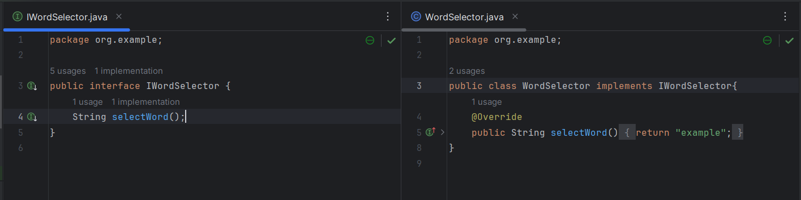

## Test WordSelector

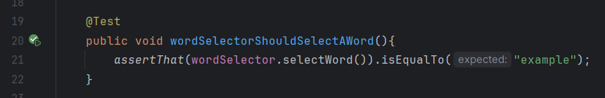

## Clase HintGenerator

Clase encargada de generar la pista de nuestro juego, esta nos dira por ejemplo cuantas letras tiene la palabra seleccionada. Al igual que con la clase WordSelector

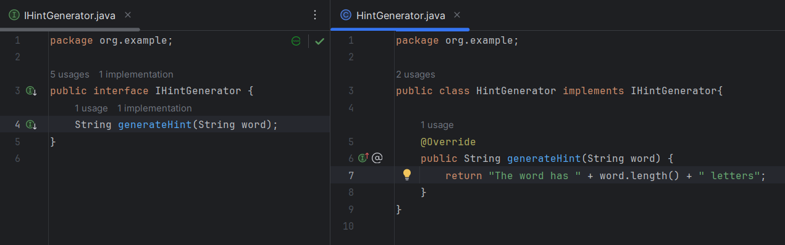

## Test HintGenerator

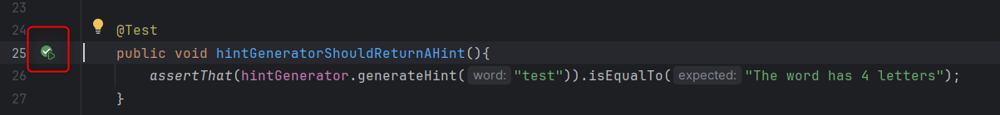

## Clase Game

Clase principal del juego que se encarga de inicializar una partida, esta recibiria como parametros al selector de palabras (WordSelector) asi como al generador de pistas (HintGenerator) y por ultimo tendria un metodo para inicializar el juego.

## Test Game

Para desarrollar con TDD primero escribimos pruebas y luego funcionalidades. Testeamos el metodo para inicializar el juego y se observa que la prueba falla por que si bien el metodo start esta definido, su funcionalidad aun no es la correcta. Para esto agregamos logica al metodo start que verifica si la palabra o la pista no sea nula y luego inicializa el juego

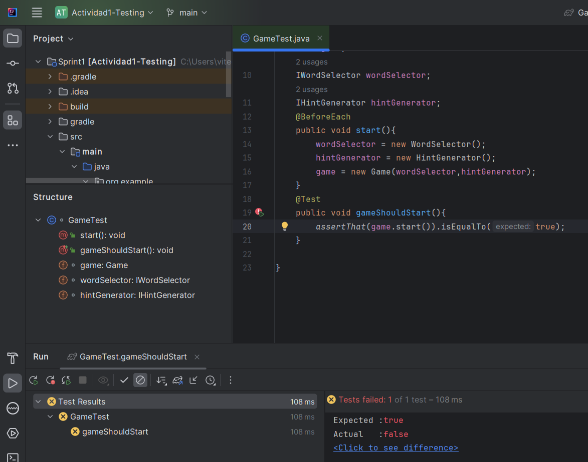

Agregamos la lógica necesaria para hacer pasar la prueba y vemos que ahora si pasa todo a verde

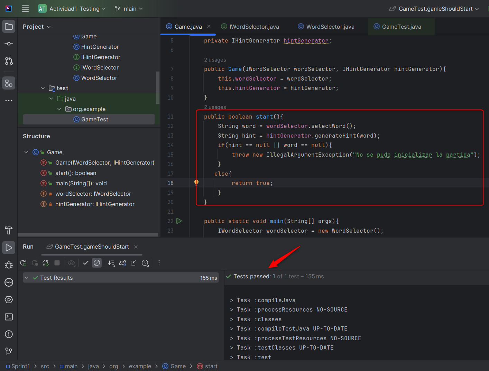

## SonarCloud

Para analizar nuestro codigo, ya sean las metricas, codesmells, codecoverage usaremos sonarlint y sonarcloud. Ejecutamos ./gradlew sonar y se observa el analisis en nuestro cloud

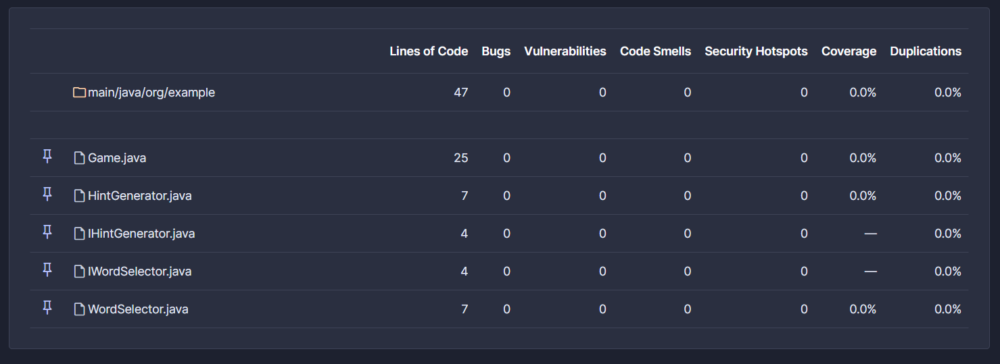

Por el momento no se observan problemas asi que no es necesario refactorizar

# Sprint 2: Lógica de juego y retroalimentación

## Clase Game (Ampliación & Refactorización)

En este punto ya queremos ampliar la logica para recibir adivinanzas del jugador, para esto el juego debería iniciar dando la pista. Si queremos añadir esta opcion debemos crear otro metodo aparte de start y volver a instanciar el wordselecter, esto nos llevaria a un mal camino ya que estariamos repitiendo codigo innecesariamente.

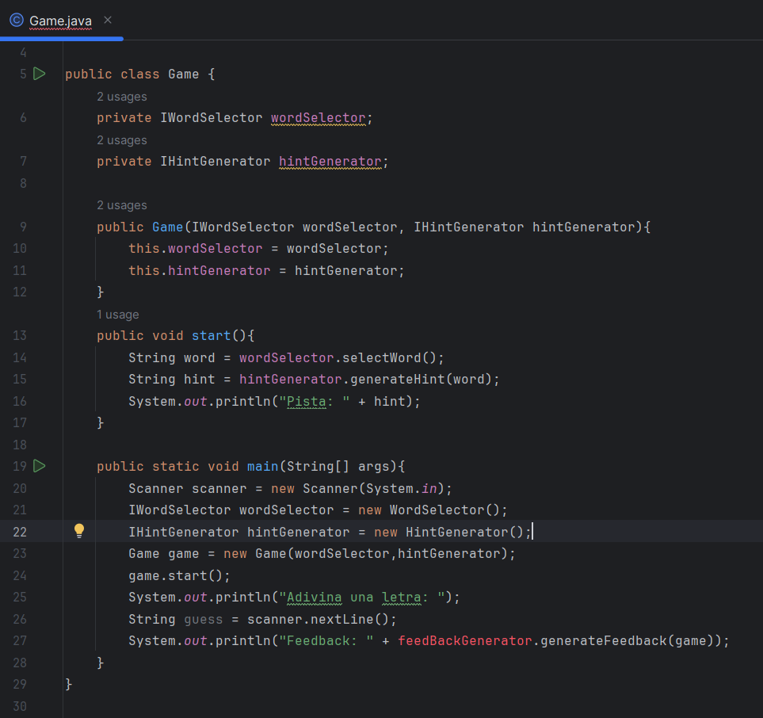

## Clase FeedBackGenerator 

En la imagen previa se observa que creamos un objeto del tipo FeedBackGenerator para tener un seguimiento de los intentos del usuario para adivinar la palabra. Para implementarla, empezaremos con las pruebas de ahi con sun funcionalidad

## Test FeedBackGenerator

Las pruebas fallan como se espera
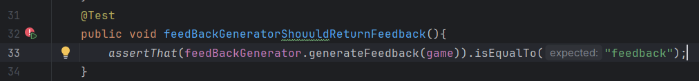

Agregamos la lógica del feedBackGenerator para hacer pasar las pruebas a verde

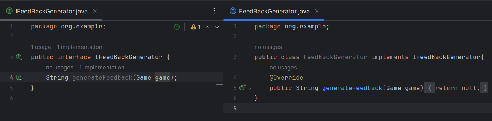

Y las pruebas pasan satisfactoriamente

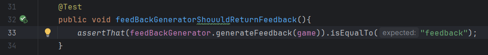

## LCOM4

**Clase Game**

Metodos identificados en la clase Game:

- `start`: Utiliza wordSelector y hintGenerator
- `main`: Utiliza instancias de la clase Game, WordSelector y HintGenerator

Numero de componentes conectados = LCOM4 = 2

> Entonces la clase Game necesita refactorizacion

Tanto la clase WordSelector, HintGenerator y FeedBackGenerator solo tienen 1 componente asolado entonces no es necesario refactorizar

## CAMC

**Clase Game**

- `Game`: Tiene 3 parametros unicos (IWordSelector, IHintGenerator, int)
- `start`: No tiene parametros
- `main`: Tiene 1 parametro unico (String[])

Sumas de tipos de parametros unicos: 3 + 0 + 1 = 4

Numero total de metodos: 3

Numero maximo de parametros por metodo: 3

CAMC = 4 / 3*3 = 0.44

> CAMC cercano a 0 significa baja cohesion por ende necesita refactorizacion

Al igual que con el LCOM4 las clases WordSelector, HintGenerator y FeedBackGenerator solo tienen 1 metodo con a lo mucho 1 parametro entonces su CAMC = 1 por ende no necesitan refactorizacion

## Sonar

Volvemos a ejectuar sonar y detecta olores de codigo que se van a solucionar en el siguiente punto junto a las refactorizaciones basadas en las metricas

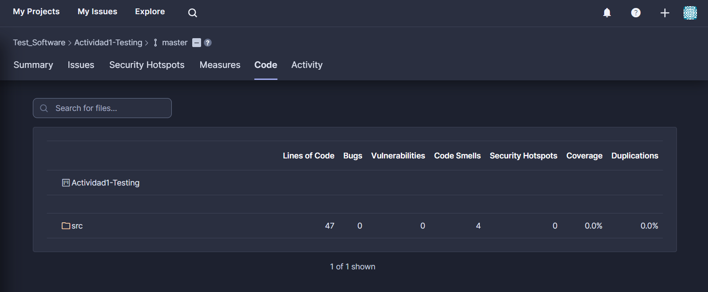

## Refactorización

**Clase Game**

- Separamos el metodo main en una nueva clase asi como tambien solucionamos los code smells como remover la variable `intentos` que estaba en la linea 6 y que no se utiliza en la clase Game reduciendo el numero de parametros en nuestra clase

- Clase FeedBackgenerator: Cambiamos el parametro por un string guess en vez de un objeto de la clase Game

# Sprint 3: Refinamiento y finalizacion

## Clase Game

En este print vamos a concluir la logica de nuestro juego utilizando TDD

### Prueba para verificar que se decremente el numero de intentos en cada adivinanza

Las pruebas fallan asi que implementamos la logica necesaria en nuestra clase Game

- Se crea el metodo guessLetter
- Getters y Setters para los intentos

### Prueba para verificar que se adivinen todas las letras

Logica para la prueba

- Se crea la varible wordSelected
- Se crea una Lista para almacenar las letras adivinadas
- Se crea el metodo isWon con logica para verificar que se hayan adivinado cada una de las letras de la palabra seleccionada

### Pruebas para verificar que el usuario pueda visualizar si gana o no

Agregamos la logica

- Se agrega el metodo checkGameStatus que retorna un mensaje ya sea de victoria o derrota

Corremos todas las pruebas implementadas y se observa que todas pasan

## Analisis y Refactorizacion

Con el programa funcional y todas las pruebas en verde, analizamos la calidad del codigo con las metricas y si es necesario refactorizamos. Nos enfocaremos en la clase Game ya que esta es la que contiene gran parte de la logica del programa.

**Clase Game**

Metodos identificados en la clase Game:

> No tomaremos en cuenta el constructor ni los getters y setters

- `start`: Usa wordSelector y hintGenerator
- `guessLetter`: Usa el feedBack generator
- `isWon`: Usa la variable wordSelected y la lista guessedLetter
- `checkGameStatus`: Solo usa la variable wordSelected

Nuestro numero de componentes conectados serian 1, el metodo isWon y el metodo checkGameStatus comparten el uso de la variable wordSelected entonces nuestro LCOM = 1 lo cual significa alta cohesion que es el objetivo principal

## Resultados

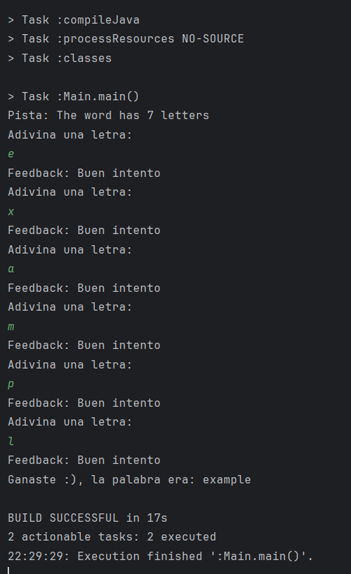

